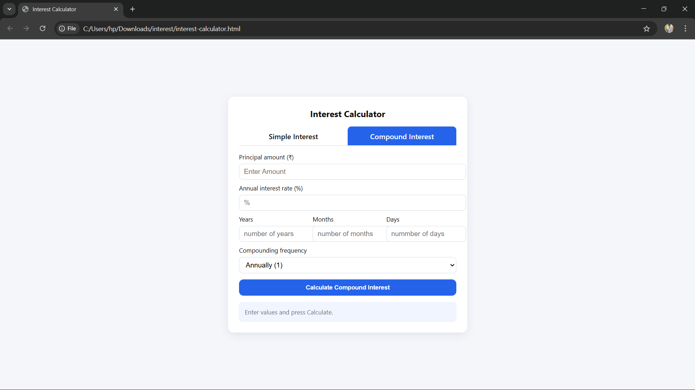

# Interest Calculator

This project is a simple web-based **Interest Calculator** that includes both **Simple Interest** and **Compound Interest** calculators.

## Files

- `interest-calculator.html` — The main HTML file (structure of the page).
- `style.css` — CSS file for styling the page.
- `script.js` — JavaScript file with logic for calculations and tab switching.
- `README.md` — This file.

## How to Use

1. Place all files in the same folder.
2. Open `interest-calculator.html` in any modern web browser (Chrome, Edge, Firefox, etc.).
3. Use the tabs at the top to switch between **Simple Interest** and **Compound Interest** calculators.
4. Enter:
   - Principal amount (₹)
   - Annual interest rate (%)
   - Duration (Years, Months, Days)
   - For Compound Interest: select compounding frequency (Annual, Semi-annual, Quarterly, Monthly, Daily)
5. Click the **Calculate** button to see the results.

## Formulas Used

- **Simple Interest:**  
  \[ SI = P \times R \times T \]  
  where `P` = Principal, `R` = Annual Rate (in decimal), `T` = Time in years.

- **Compound Interest:**  
  \[ A = P (1 + R/N)^{N \times T} \]  
  where `N` = number of compounding periods per year, `A` = total amount, Interest = `A - P`.

## Notes

- Time is converted into years using:  
  `Years + (Months / 12) + (Days / 365)`
- The currency symbol (₹) is used, but you can replace it with `$` or any other currency symbol in the HTML.

